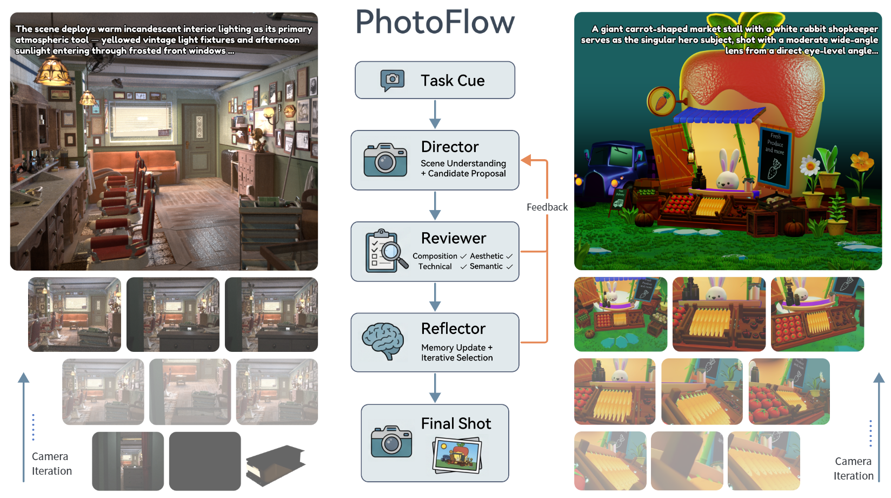
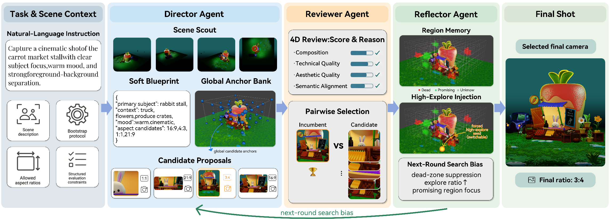

# PhotoFlow: Agentic 3D Virtual Photography Missions

<p align="left">
  <a href="https://arxiv.org/abs/2605.23771"></a>
  <a href="https://visionary-laboratory.github.io/PhotoFlow/"></a>
  <a href="https://huggingface.co/papers/2605.23771"></a>
  <a href="https://huggingface.co/datasets/sjijs/VPhotoBench"></a>
</p>

**PhotoFlow** is an agentic framework for language-conditioned virtual photography in controllable 3D scenes. Given a Blender scene and a natural-language photography intent, PhotoFlow searches for an executable camera state, including camera pose, look-at target, lens, aperture, and aspect ratio, then renders the final photograph.

## Teaser



## Overview

PhotoFlow treats virtual photography as a closed-loop spatial-aesthetic search problem. The agent is organized around three roles:

- **Director** proposes diverse candidate camera states from scene scouts, soft photographic blueprints, global anchors, and region memory.
- **Reviewer** evaluates rendered previews using structured rule checks, visual critique, and pairwise incumbent selection.
- **Reflector** converts failures into search bias, dead-zone suppression, and high-exploration relocation.



We also introduce **VPhotoBench**, a benchmark of language-conditioned virtual photography missions over open-license Blender scenes. The benchmark is designed to evaluate whether an agent can satisfy spatial constraints, semantic intent, aspect-ratio choices, and photographic quality in fully virtual art scenes.

## Resources

- Paper: [arXiv:2605.23771](https://arxiv.org/abs/2605.23771)
- Hugging Face paper page: [huggingface.co/papers/2605.23771](https://huggingface.co/papers/2605.23771)
- Project page: [visionary-laboratory.github.io/PhotoFlow](https://visionary-laboratory.github.io/PhotoFlow/)
- Benchmark dataset: [VPhotoBench on Hugging Face](https://huggingface.co/datasets/sjijs/VPhotoBench)

## Release Status

- [ ] **Agent Code** Director-Reviewer-Reflector implementation, prompts, JSON schemas, and run configurations.
- [X] **VPhotoBench** Scene registry, task specifications, benchmark construction notes, and asset metadata.
- [ ] **Evaluation** External metric aggregation, baseline configs, ablation summaries, and selected logs.

## Benchmark Assets

VPhotoBench is built from publicly available Blender scenes and contains 47 Blender scene files paired with 141 language-conditioned photography missions. Third-party Blender assets remain governed by their original licenses; see the Hugging Face dataset card for per-asset license and attribution metadata.

## Citation

```bibtex
@misc{guo2026photoflowagentic3dvirtual,
      title={PhotoFlow: Agentic 3D Virtual Photography Missions},
      author={Jiarui Guo and Haojia Wei and Yiming Zhang and Yifei Liu and Yuning Gong and Hongjie Zhang and Xue Yang and Zhihang Zhong},
      year={2026},
      eprint={2605.23771},
      archivePrefix={arXiv},
      primaryClass={cs.CV},
      url={https://arxiv.org/abs/2605.23771},
}
```

## License

The project license will be finalized before the full code release. Third-party Blender assets remain governed by their original licenses.
